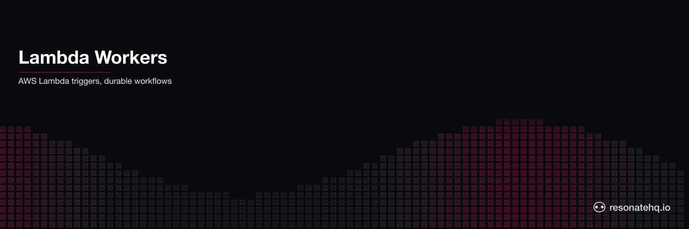

<p align="center">
  <picture>
    <source media="(prefers-color-scheme: dark)" srcset="./assets/banner-dark.png">
    <source media="(prefers-color-scheme: light)" srcset="./assets/banner-light.png">
    
  </picture>
</p>

# Lambda Workers

**Resonate Python SDK**

AWS Lambda as a stateless trigger for durable Python workflows. Lambda accepts the request and returns 202 immediately; the actual work runs on a long-running Resonate worker that has no 15-minute ceiling.

```
API Gateway --> POST /process-document --> Lambda (returns 202 immediately)
                                              |
                                              v
                                resonate.begin_rpc("doc/job_123", "process_document", job)
                                              |
                                              v
                                    Resonate Server (durable state)
                                              |
                                              v
                                Resonate Worker (long-running Python process)
                                  |- download_document  (checkpointed)
                                  |- extract_text       (checkpointed)
                                  |- analyze_document   (checkpointed, LLM call)
                                  |- store_results      (checkpointed)
                                  |- notify_requester   (checkpointed)

GET /status/:jobId --> Lambda polls resonate.get("doc/job_123")
```

## Why Lambda alone isn't enough

| Constraint                  | Lambda alone           | Lambda + Resonate                       |
| --------------------------- | ---------------------- | --------------------------------------- |
| Max execution               | 15 minutes             | Unlimited                               |
| Wait for human approval     | Not possible           | `ctx.promise()` blocks indefinitely     |
| Retry failed steps          | Full function restart  | Only the failed step retries            |
| State across invocations    | Lost on timeout        | Persisted in Resonate Server            |
| Idempotency                 | DIY                    | Built-in (promise ID)                   |

## The Lambda handler pattern

```python
# lambda_function.py
from resonate import Resonate

resonate = Resonate.remote(group="gateway", host=os.environ.get("RESONATE_HOST"))

def lambda_handler(event, _context=None):
    job = json.loads(event["body"])

    # Non-blocking: hands work to the worker group, then returns.
    resonate.options(target="poll://any@worker").begin_rpc(
        f"doc/{job['jobId']}",
        "process_document",
        job,
    )

    return {"statusCode": 202, "body": json.dumps({"status": "accepted"})}
```

**The role split:** Lambda is a stateless trigger. Its only job is to call `resonate.begin_rpc(...)` — same shape as invoking any async function — and return 202. The durable workflow runs on a separate long-running Python process (`worker.py`), which has no 15-minute ceiling. No CDK stack to coordinate Lambda-as-executor, no IAM glue between your Lambda and the workflow steps, no service registration per step — Lambda triggers, the worker runs.

## Files

```
lambda_function.py   # Lambda handler — POST /process-document, GET /status/:jobId
worker.py            # Long-running Resonate worker — the durable workflow
pyproject.toml       # resonate-sdk>=0.6.3
```

## Prerequisites

- Python 3.13
- [`uv`](https://docs.astral.sh/uv/) for environment + dependency management
- A running [Resonate Server](https://docs.resonatehq.io/deploy/run-server) (legacy server: `resonate serve`)

> **Server compatibility note.** The Python SDK currently targets the legacy Resonate Server (`resonate serve`). It is **not** compatible with `resonate dev` (server v0.9.x) at this time.

## Run it locally

You can exercise the full pattern on one machine — no AWS account required.

### 1. Install dependencies

```bash
uv sync
```

### 2. Start the Resonate Server (legacy)

```bash
resonate serve --aio-store-sqlite-path :memory:
```

### 3. Start the Resonate worker

In a second terminal:

```bash
uv run python worker.py
```

You should see:

```
[worker]     starting — registered: process_document
[worker]     waiting for work from the Resonate Server...
```

### 4. Invoke the Lambda handler locally

In a third terminal, use the built-in `__main__` block to fire a synthetic API Gateway event:

```bash
uv run python lambda_function.py job-001
```

You'll see a 202 response immediately. Switch back to the worker terminal — it will log the five checkpointed steps as the workflow runs.

To poll for the result:

```bash
uv run python -c "
import json, lambda_function as l
event = {'httpMethod': 'GET', 'path': '/status/job-001', 'pathParameters': {'jobId': 'job-001'}}
print(json.dumps(l.lambda_handler(event), indent=2))
"
```

## Deploy to AWS

### 1. Provision the Resonate Server + worker

The Resonate Server and the worker are long-running processes. Lambda is the only piece that's serverless. Run them on whatever you prefer:

- ECS / Fargate
- A small EC2 instance
- Resonate Cloud (when available for your workload)

```bash
# On your server host
resonate serve --aio-store-sqlite-path /var/lib/resonate/state.db

# On your worker host (can be the same machine)
RESONATE_HOST=http://<your-server> uv run python worker.py
```

### 2. Package the Lambda function

Because `resonate-sdk` is a third-party dependency, you need to ship it with the Lambda. Two common options:

**Option A — Zipped dependencies:**

```bash
mkdir -p lambda-package
uv pip install --target lambda-package resonate-sdk>=0.6.3
cp lambda_function.py lambda-package/
cd lambda-package && zip -r ../lambda-package.zip . && cd ..
```

**Option B — Lambda layer:** publish `resonate-sdk>=0.6.3` as a layer and attach it to the function. The handler zip then contains only `lambda_function.py`.

### 3. Create the Lambda function

```bash
aws lambda create-function \
  --function-name document-processor \
  --runtime python3.13 \
  --handler lambda_function.lambda_handler \
  --zip-file fileb://lambda-package.zip \
  --role arn:aws:iam::<account>:role/<lambda-role> \
  --environment "Variables={RESONATE_HOST=http://<your-server>,RESONATE_STORE_PORT=8001,RESONATE_MESSAGE_SOURCE_PORT=8002}"
```

Wire up an API Gateway HTTP API in front of it and route:

- `POST /process-document` -> `document-processor`
- `GET /status/{jobId}` -> `document-processor`

### 4. Test against the deployed Lambda

```bash
# Submit a document
curl -X POST https://<your-api-gateway>/process-document \
  -H "Content-Type: application/json" \
  -d '{
    "jobId": "job-001",
    "documentUrl": "s3://my-bucket/contract.pdf",
    "requesterId": "user-alice",
    "type": "contract"
  }'
# -> { "status": "accepted", "jobId": "job-001" }

# Poll for the result
curl https://<your-api-gateway>/status/job-001
# -> { "status": "processing", "jobId": "job-001" }
# -> { "status": "done", "jobId": "job-001", "result": { ... } }
```

## Idempotency

The `jobId` is the Resonate promise ID (`doc/<jobId>`). Submit the same `jobId` twice -> same workflow execution, no duplicate processing. This is essential for Lambda because:

- API Gateway may retry on timeout
- Your client may retry on network failure
- Both are handled automatically — the document is processed exactly once.

---

[Resonate](https://resonatehq.io) - [Docs](https://docs.resonatehq.io) - [Python SDK](https://github.com/resonatehq/resonate-sdk-py)
